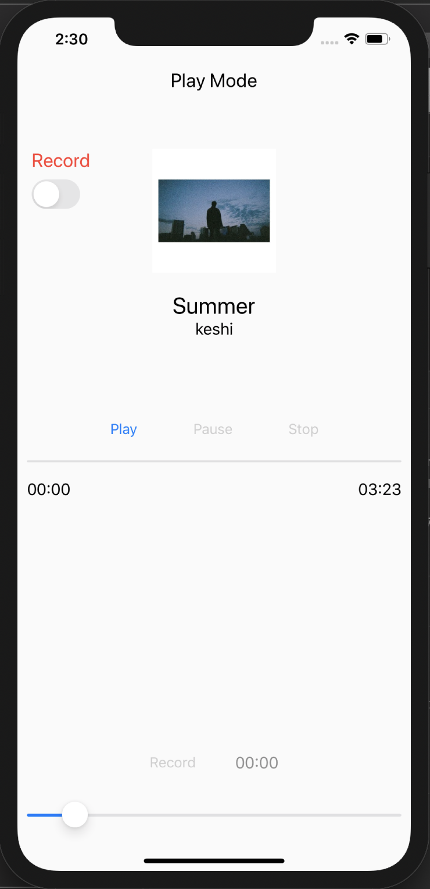
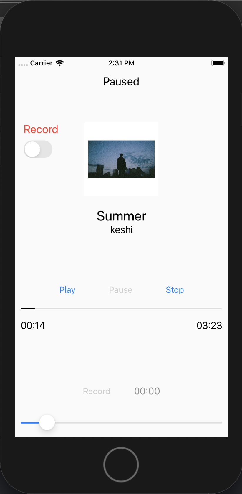
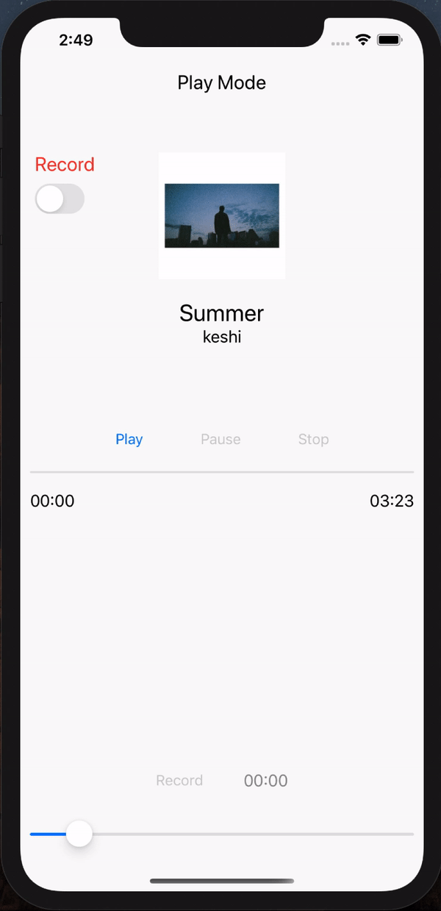
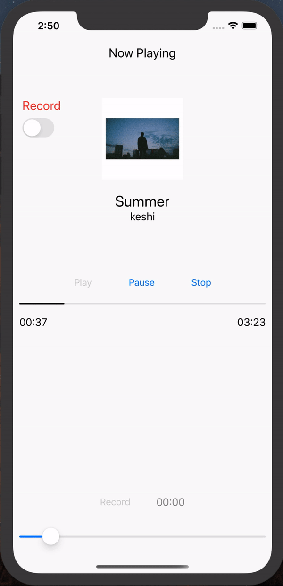
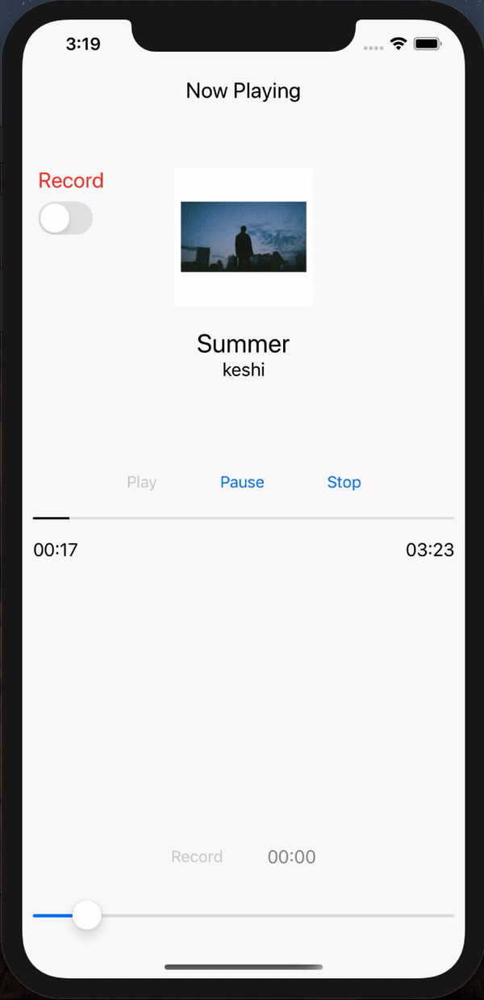
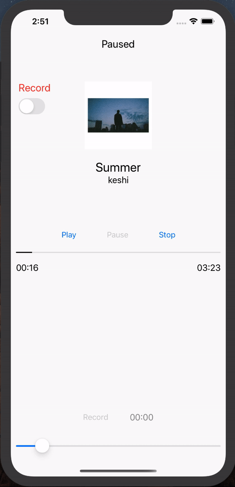
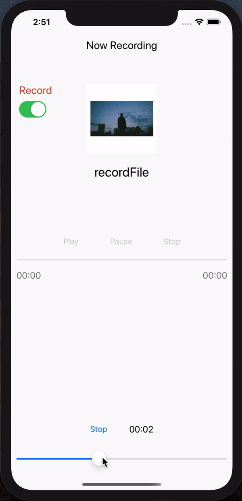
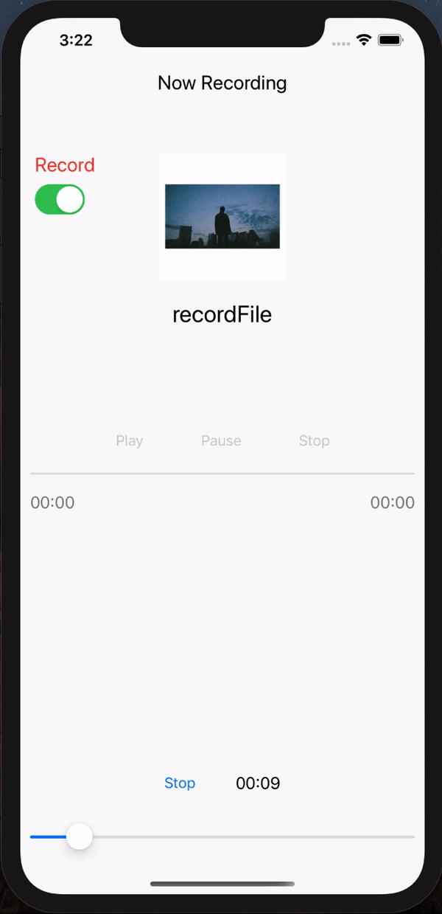

<h2 align="center">
  Music Player
</h2>

<p align="center">
  음악 플레이어
</p><hr>

|                      iPhone 11 Pro Max                       |                          iPhone 8                           |
| :----------------------------------------------------------: | :---------------------------------------------------------: |
|  |  |

### DEMO

#### 재생모드

|                   Play                   |                   Pause                   |                     Stop                     |
| :--------------------------------------: | :---------------------------------------: | :------------------------------------------: |
|  |  |  |


#### 녹음모드

|                   Record                   |                      Stop                      |                        Play                        |
| :----------------------------------------: | :--------------------------------------------: | :------------------------------------------------: |
|  |  |  |


### Code

#### 오디오 파일 추가하기

```
audioFile = Bundle.main.url(forResource: "hello_world", withExtension: "mp3")
```


#### 시간 00:00 형태로 바꾸기

```swift
func convertNSTimeInterval2String(_ time: TimeInterval) -> String {

}
```


#### 재생 시간 및 녹음 시간 표시하기

```swift
var progressTimer: Timer!

progressTimer = Timer.scheduledTimer(timeInterval: 0.1, target: self, selector: timePlayerSelector, userInfo: nil, repeats: true)

let timePlayerSelector: Selector = #selector(AudioViewController.updatePlayTime)

@objc func updatePlayTime() {
		labelCurrentTime.text = convertNSTimeInterval2String(audioPlayer.currentTime)
		progressViewPlay.progress = Float(audioPlayer.currentTime / audioPlayer.duration )
}


progressTimer.invalidate()
```

#### 녹음해서 파일에 저장하기

```swift
let documentDirectory = FileManager.default.urls(for: .documentDirectory, in: .userDomainMask)[0]
audioFile = documentDirectory.appendingPathComponent("recordFile.m4a")
```


